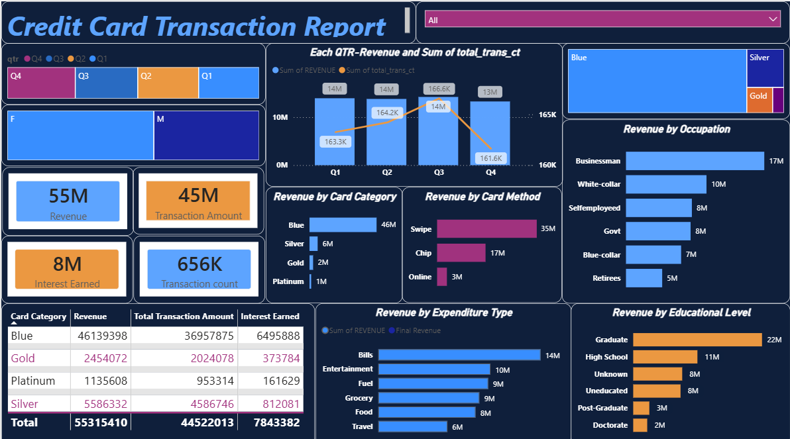

# 💳 Credit Card Transaction Analysis Dashboard | Power BI

## 📌 Project Overview

This project demonstrates end-to-end data analysis, including data modeling, DAX calculations, and interactive dashboard design.  Also, this project presents an interactive **Power BI dashboard** designed to analyze credit card transaction data and uncover actionable insights related to customer behavior, revenue trends, and spending patterns.

The dashboard enables stakeholders to quickly understand **key drivers of revenue**, identify high-value customer segments, and monitor transaction performance across multiple dimensions.

---

## Dashboard Screenshot :

---

## 🎯 Business Objective

* Analyze revenue and transaction trends across time (quarterly analysis)
* Identify top-performing customer segments (occupation, education)
* Understand spending behavior across categories
* Evaluate transaction methods and card usage patterns

---

## 📊 Dashboard Highlights

### 🔹 Key Metrics (KPIs)

* **Total Revenue:** 55M
* **Transaction Amount:** 45M
* **Interest Earned:** 8M
* **Transaction Count:** 656K

### 🔹 Analytical Insights

* 📈 **Quarterly Trends:** Revenue remains stable with peak performance in Q3
* 👨‍💼 **Top Segment:** Businessman category generates highest revenue
* 🎓 **Education Insight:** Graduates contribute the most to revenue
* 💳 **Card Usage:** Swipe method dominates transaction volume
* 🛒 **Spending Behavior:** Bills and Entertainment are top expenditure categories

---

## 🧠 Key Insights

* A small number of customer segments contribute disproportionately to total revenue
* Spending is concentrated in essential and lifestyle categories
* Digital and swipe-based transactions dominate over online methods
* Opportunity exists to target underperforming segments for growth

---

## 🛠️ Tools & Technologies

* **Power BI** (Data Visualization & Dashboarding)
* **DAX** (Basic measures and aggregations)
* **Data Modeling** (Fact & dimension structuring)

---

## 📁 Repository Contents

* `CreditCardDashboard.pbix` → Power BI dashboard file
* `dashboard.png` → Dashboard preview image
* `README.md` → Project documentation

---

## 🚀 How to Use

1. Download the `.pbix` file
2. Open in **Power BI Desktop**
3. Interact with slicers (Quarter, Gender, etc.)
4. Explore insights across different visualizations

---

## 💡 Future Enhancements

* Add **customer segmentation (RFM analysis)**
* Implement **forecasting for revenue trends**
* Integrate **real-time or streaming data**
* Enhance interactivity with drill-through pages

---

## 👤 About Me

**Ekamdeep Singh**
Aspiring Data Analyst with a focus on building business-driven dashboards and extracting meaningful insights from data.

---

## 🔗 Connect With Me

* LinkedIn: www.linkedin.com/in/ekamdeep-singh-6336773b4

---

